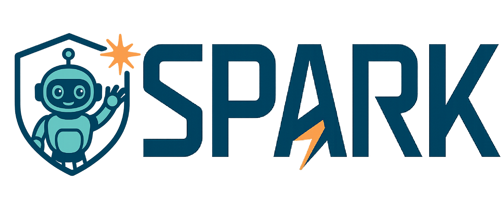
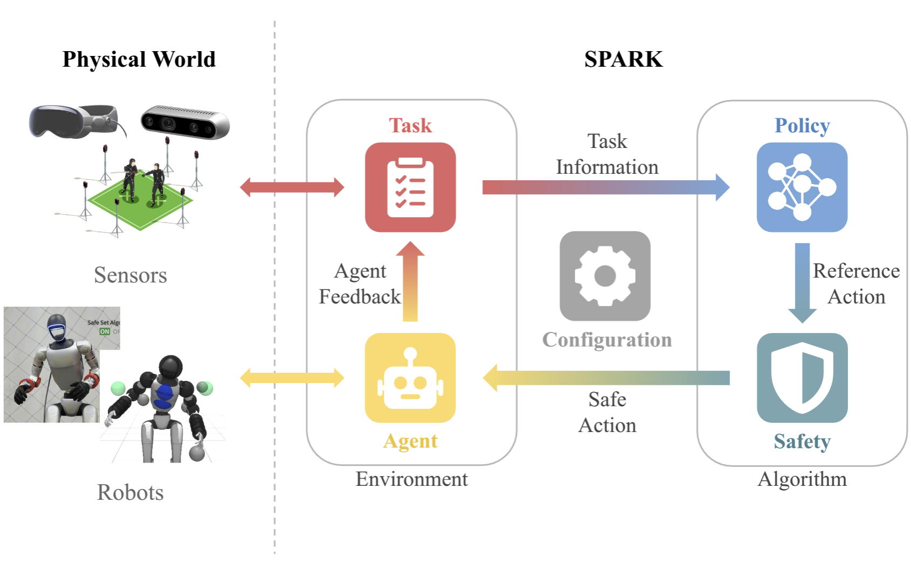

<div align="center">
  
</div>

<p align="center">
  <a href="#installation">Installation</a> |
  <a href="#quick-start">Quick Start</a> |
  <a href="#framework">Framework</a> |
  <a href="#robots-and-demonstrations">Robots</a> |
  <a href="#local-documentation">Documentation</a>
</p>

---

SPARK—the Safe Protective and Assistive Robot Kit—is a modular framework for
building robot applications from reusable robot models, tasks, policies,
safety components, and execution backends. Its interfaces support
manipulators, mobile manipulators, and humanoids without tying planning or
control algorithms to one robot family.

SPARK includes numerical dynamics and kinematics, MuJoCo simulation, optional
Isaac GPU simulation, planning and control policies, safety filters,
teleoperation, and reproducible evaluation pipelines. Capability-specific
dependencies remain optional, so a CPU research workflow does not need to
install the complete GPU or hardware stack.

The project accompanies the paper [*SPARK: Safe Protective and Assistive Robot
Kit*](https://arxiv.org/abs/2502.03132). See the
[documentation](docs/index.md), [examples](example/), and
[changelog](CHANGELOG.md) for the complete public surface.

SPARK code is MIT-licensed. Bundled robot and learned-policy assets may retain
separate upstream terms; review [THIRD_PARTY_NOTICES.md](THIRD_PARTY_NOTICES.md)
before redistributing a source or binary release.

<div align="center">
  
</div>

## Installation

Python 3.10 or newer is an installation requirement for every SPARK package.
The installer defaults the `core` and `mujoco` profiles to Python 3.10. **If
the Isaac module is installed or used, Python 3.12.x is required** by the
release-qualified Isaac Sim 6 stack; Python 3.10 or 3.11 is not sufficient for
that optional profile. Choose the smallest profile that provides the
capabilities needed by your project.

| Profile | Includes | Typical use |
|---|---|---|
| `core` | Numerical dynamics, CPU kinematics, planning, control, estimation, and safety | Algorithm development without a simulator |
| `mujoco` | Core plus MuJoCo and visualization | Local simulation and most examples |
| `isaac` | MuJoCo plus Python 3.12, CUDA PyTorch, Isaac Sim/Lab, cuRobo, and learned-policy runtimes | GPU simulation and parallel environments |

Using Conda:

```bash
./install.sh --name spark --profile mujoco
conda activate spark
```

For a lightweight core installation or the complete NVIDIA profile:

```bash
./install.sh --name spark_core --profile core
./install.sh --name spark_isaac --profile isaac
```

Using a repository-local virtual environment:

```bash
./install.sh --env-manager uv --path .venv --profile mujoco
source .venv/bin/activate
```

Optional capabilities can be combined with the core or MuJoCo profiles:

| Flag | Adds |
|---|---|
| `--torch` | PyTorch without the other learned-policy packages |
| `--learned` | PyTorch, ONNX runtimes, and training utilities |
| `--ros` | Python helpers for a separately installed host ROS environment |
| `--unitree-sdk` | Unitree SDK and CycloneDDS support |
| `--dev` | Tests, correctness checks, build/release tools, and an interactive debugger |

The installer keeps ROS, robot SDKs, learned models, and NVIDIA packages out of
minimal environments unless explicitly selected. See the
[installation guide](docs/getting_started/installation.md) for platform notes,
tested versions, overrides, and verification commands.

### macOS

The numerical `core` profile supports Apple Silicon and Intel Macs. The
`mujoco` profile supports native Apple Silicon on macOS 12 or newer; current
MuJoCo 3.4+ packages do not provide Intel-macOS wheels. Install Apple's command
line tools and use a native arm64 Conda/Miniforge or `uv` environment:

```bash
xcode-select --install
./install.sh --env-manager uv --path .venv --profile mujoco
source .venv/bin/activate
```

Intel Mac users should select `--profile core`. Do not set `MUJOCO_GL=egl` on
macOS; the viewer uses the native macOS graphics path. Isaac/CUDA and the
released Unitree hardware SDK integration remain Linux-only. `--torch` and
`--learned` install the native macOS PyTorch stack, which may use Apple MPS when
the selected algorithm supports it.

### Docker

SPARK 2.0 retains the container workflow from the 1.0 release and aligns it
with the new dependency profiles. Docker Engine with Compose v2 is required.
Build the lightweight numerical image or the default MuJoCo image with:

```bash
docker compose --profile core build spark-core
docker compose --profile default build spark-default
```

Run an example through the compatibility launcher; `default` and `mujoco`
select the same Python 3.10 MuJoCo image:

```bash
./run_with_docker.sh default \
  example/kinova_gen3/run_kinova_gen3_benchmark.py \
  --backend mujoco --test-case arm_goal_static_v0 --headless
```

The `isaac` image uses Python 3.12 and requires the NVIDIA Container Toolkit.
It is intentionally separate because its download and image size are much
larger:

```bash
OMNI_KIT_ACCEPT_EULA=YES docker compose --profile isaac build spark-isaac
OMNI_KIT_ACCEPT_EULA=YES ./run_with_docker.sh isaac \
  example/kinova_gen3/run_kinova_gen3_benchmark.py \
  --backend isaac --test-case arm_goal_static_v0 --num-envs 1 --headless
```

Additional `ros` and `wsl` profiles preserve the corresponding SPARK 1.0
container variants. Optional build flags such as `SPARK_WITH_LEARNED=true` and
`SPARK_WITH_DEV=true` map to the regular installer rather than changing the
base installation contract. See the
[container installation guide](docs/getting_started/installation.md#docker)
for viewer forwarding, profile details, and validation commands.

## Quick Start

Install the core profile, then exercise a robot-selected dynamics model from
the repository root:

```python
import numpy as np
from spark_robot import KinovaGen3SingleArmDynamic2Config

robot = KinovaGen3SingleArmDynamic2Config()
model = robot.create_dynamics_model()
state = np.zeros(model.state_dim)
control = np.full(model.control_dim, 0.25)
next_state = model.step(state, control, dt=0.02, integrator="RK4")

print(model.variant, model.dimensions)
print(next_state)
```

Interactive and benchmark entry points for AgiBot G1, Galaxea R1 Lite, FANUC
LR Mate 200iD, KUKA iiwa 14, Kinova Gen3, and Unitree G1 live under
[`example/`](example/). The [quick-start guide](docs/getting_started/quickstart.md)
explains this core API and points to the simulation tutorials. Robot
configuration selects state, control, dynamics, kinematics, limits, and
compatible execution agents; task and policy selection remain separate.

## Dynamics Selection

SPARK treats the dynamics equation, its order, the state-propagation backend,
and the numerical integrator as separate choices. They should not be inferred
from one another.

| Term | What it selects | Where it is selected | Example or viewer value |
|---|---|---|---|
| Dynamics model (variant) | The state, control, and equations of motion | Robot configuration | `single_integrator`, `double_integrator`, `unicycle`, or `bicycle` |
| Dynamics order | Whether the model is first order (velocity control) or second order (acceleration/force control) | Robot configuration and its `Dynamic1`/`Dynamic2` suffix | `Dynamics order: 1` |
| Dynamics backend | Which runtime owns state propagation | `--dynamics-backend simulator` or `--dynamics-backend model` | `MuJoCo physics`, `Isaac PhysX`, or `SPARK model (Euler)` |
| Model integrator | How a continuous SPARK model is advanced over one control period | Advanced agent/model configuration; Euler is the runtime default | Euler, RK4, or ZOH/direct |

`--dynamics-backend` does not select a dynamics equation or integrator.
`simulator` lets MuJoCo or Isaac/PhysX own physical state and feedback;
`model` lets the robot-selected SPARK equation own state while the simulator
visualizes it. The public robot runners intentionally leave model integration
at Euler. For first-order models such as the FANUC single integrator,
Euler is exact for a command held constant over the control period. RK4 or ZOH
is mainly useful in custom nonlinear or second-order numerical studies.

See the [dynamics execution guide](docs/architecture/dynamics_execution.md)
for the complete backend, integrator, timing, and viewer-label tables.

## Framework

SPARK is organized around small contracts rather than a robot-specific runner.

| Component | Responsibility | Package guide |
|---|---|---|
| Robot | Coordinates, limits, dynamics, kinematics, frames, and collision geometry | [`spark_robot`](docs/modules/robot.md) |
| Agent | Adapts a simulator or physical robot to feedback and action contracts | [`spark_agent`](docs/modules/agent.md) |
| Task | Produces goals, obstacles, trajectories, termination, and metrics | [`spark_task`](docs/modules/task.md) |
| Policy | Maps feedback and task information through planning, estimation, control, and safety | [`spark_policy`](docs/modules/policy.md) |
| Environment | Coordinates agent and task transitions | [`spark_env`](docs/modules/env.md) |
| Pipeline | Selects components and owns execution, visualization, logging, and lifecycle | [`spark_pipeline`](docs/modules/pipeline.md) |

A typical control step follows this reusable flow:

1. The agent returns robot and sensor feedback.
2. The task converts feedback into goals, obstacles, and episode information.
3. The policy produces an action, optionally composing planning, estimation,
   nominal control, and a safety filter.
4. The environment applies the action through the selected agent and advances
   the task.
5. The pipeline records metrics, renders state, and manages reset or shutdown.

The same algorithm can therefore be evaluated against modeled dynamics,
MuJoCo, Isaac where supported, or a validated hardware adapter without moving
robot-specific transport into the policy. See the
[architecture guide](docs/architecture/index.md) and
[policy guide](docs/modules/policy.md) for the implementation contracts.

### Included algorithm families

- PID, trajectory playback/tracking, LQR, finite-horizon LQR, MPC, iLQR, MRAC,
  and iterative learning control;
- inverse kinematics, trajectory optimization, and RRT-Connect planning;
- Kalman filtering and parameter estimation;
- safety set, control-barrier, potential-field, sliding-mode, and tensor safety
  components;
- optional learned whole-body policies, including WBT, Sport, and SONIC for
  supported Unitree configurations.

## Robots and Demonstrations

The released robot library spans humanoids, mobile manipulators, collaborative
arms, and industrial manipulators.

| Robot family | Direct dynamics | MuJoCo | Isaac | Released hardware adapter |
|---|---:|---:|---:|---:|
| Unitree G1 | Yes | Yes | Single + tensor | Yes |
| AgiBot G1 | Yes | Yes | Single + tensor | No |
| Galaxea R1 Lite | Yes | Yes | Single + tensor | No |
| Kinova Gen3 | Yes | Yes | Single + tensor | No |
| KUKA iiwa 14 | Yes | Yes | Single + tensor | No |
| FANUC LR Mate 200iD | Yes | Yes | Single + tensor | No |

Backend availability and workflow maturity are distinct. Consult the
[backend support matrix](docs/reference/backend_support.md) and the
[robot module guide](docs/modules/robot.md) before selecting a simulator or
hardware target.

All 35 physical-arm and mobile-manipulator configurations in these five
non-Unitree families use the same declarative Isaac contract; the adapter has
no robot-name branches. The release matrix exercises scripted teleoperation
and goal reaching with simulator-owned and model-owned dynamics in scalar and
four-environment modes on both simulators:

```bash
python tools/run_robot_support_matrix.py \
  --backend mujoco isaac \
  --report docs/reference/robot_support_matrix.json
```

Isaac is intentionally run in a separate process per robot configuration so
PhysX/GridCloner state cannot leak between imported assets. See the
[backend support matrix](docs/reference/backend_support.md) for exact scope,
asset provenance, and individual example commands.

<table>
  <tr>
    <td align="center"><b>Kinova Gen3</b><br></td>
    <td align="center"><b>AgiBot G1</b><br></td>
  </tr>
  <tr>
    <td align="center"><b>KUKA iiwa 14</b><br></td>
    <td align="center"><b>Galaxea R1 Lite</b><br></td>
  </tr>
  <tr>
    <td align="center"><b>FANUC LR Mate 200iD</b><br></td>
    <td align="center"><b>Unitree G1 WBT</b><br></td>
  </tr>
  <tr>
    <td align="center"><b>Unitree G1 Sport</b><br></td>
    <td align="center"><b>Isaac parallel benchmark</b><br></td>
  </tr>
</table>

The [showcase](docs/tutorials/showcase.md) and
[curated media catalog](docs/media/demos/robot_matrix/README.md) summarize the
representative release workflows. Detailed robot-local commands live in the
corresponding robot guides, and the complete 105-case visual matrix can be
generated locally without adding it to the release repository.

## Local Documentation

Until a hosted documentation site is available, build and view the complete
Sphinx site locally. Install its pinned dependencies once:

```bash
python -m pip install -r docs/requirements.txt
```

For an auto-reloading preview, run:

```bash
make -C docs livehtml
```

This rebuilds the pages when their sources change and opens the local site,
normally at <http://127.0.0.1:8000>. Keep the terminal running while browsing
and press <kbd>Ctrl</kbd>+<kbd>C</kbd> to stop the preview server.

To build once and serve the generated files without auto-reloading:

```bash
make -C docs html
python -m http.server 8000 --directory docs/_build/html
```

Then open <http://127.0.0.1:8000>. The documentation source starts at
[`docs/index.md`](docs/index.md), and generated HTML remains under
`docs/_build/`, which is intentionally excluded from version control.

## Development and Validation

Create a development environment with `--dev`. After installing the
documentation dependencies above, run:

```bash
PYTEST_DISABLE_PLUGIN_AUTOLOAD=1 python -m pytest -q
python tools/check_release.py
make -C docs clean html SPHINXOPTS="-W --keep-going"
```

The [2.0 release notes](docs/reference/v2_release_notes.md) summarize changes and
migration points from SPARK 1.0. Physical-robot
deployment requires independent simulator validation, a tested emergency stop,
and the hardware manufacturer's safety procedures.

## Contributing

Issues and pull requests are welcome. Keep reusable algorithms independent of
course assignments and application-specific experiments, and place
embodiment-specific instructions with the corresponding robot or tutorial
documentation.

## Citation

```bibtex
@inproceedings{sun2025spark,
  title={{SPARK}: Safe Protective and Assistive Robot Kit},
  author={Sun, Yifan and Chen, Rui and Yun, Kai S. and Fang, Yikuan and Jung, Sebin and Li, Feihan and Li, Bowei and Zhao, Weiye and Liu, Changliu},
  booktitle={IFAC Symposium on Robotics},
  year={2025},
  eprint={2502.03132},
  archivePrefix={arXiv}
}
```
