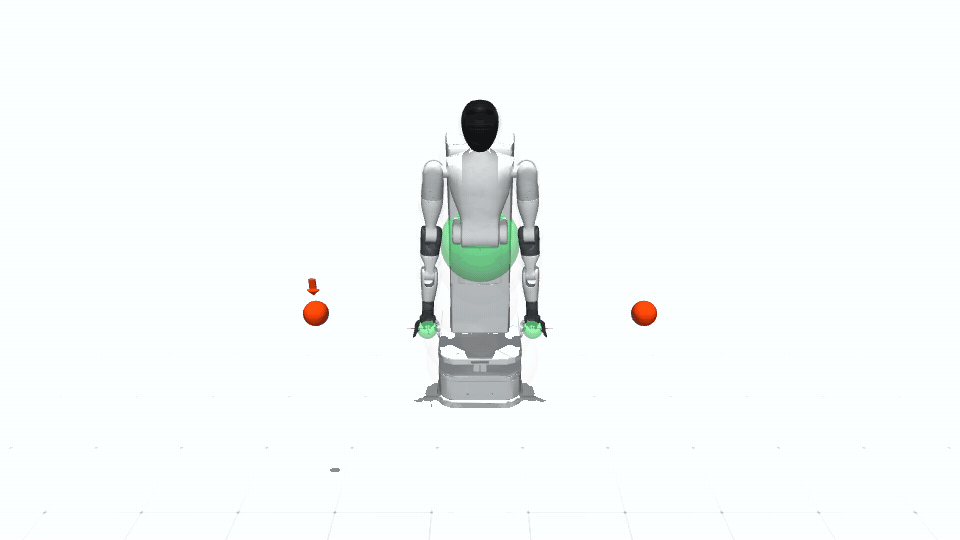

# AgiBot G1

| Configuration | DoFs | Controls | State dimension |
|---|---:|---:|---:|
| Right arm | 7 | 7 | 7 |
| Dual arm | 14 | 14 | 14 |
| Fixed base | 15 | 15 | 15 |
| Mobile base | 19 | 19 | 19 or 38 |
| Unicycle Dynamic1 view | 19 | 19 | 3 (default reduced view) |
| Bicycle Dynamic2 view | 19 | 19 | 6 (default reduced view) |

The mobile platform also supplies unicycle and bicycle dynamics for planning
and control experiments. Both retain the full physical AgiBot embodiment and
share its mobile-base MuJoCo and Isaac agents. Their default analytical views
select only the planar state and forward/yaw controls. Selecting simulator-
owned dynamics executes the shared physical planar-drive contract and emits a
warning because the analytical nonholonomic equations are no longer the state
owner; select model-owned dynamics when those exact equations are required.
The bicycle view follows the course/MATLAB state convention
`(X, Y, v_x, v_y, r, psi)`, with body-frame longitudinal/lateral velocities,
yaw rate `r`, and heading `psi`. Its public input is `(a_x, delta)`; the model
internally applies `F_x = mass * a_x` before evaluating the tire-force balance.

All seven AgiBot configurations declare MuJoCo and scalar/tensor Isaac
articulation contracts. Isaac uses embodiment-specific public agent classes,
while MobileBaseDynamic1, MobileBaseDynamic2, MobileBaseUnicycleDynamic1, and
MobileBaseBicycleDynamic2 intentionally share
`AgiBotG1MobileBaseIsaacAgent`. `Dynamic1` consistently denotes first-order
state with velocity-like control; `Dynamic2` denotes position-plus-velocity
state with acceleration-like control. Unicycle and bicycle identify the
planar mobility equation, independently of that order. The planar base is
generated from x/y/yaw joint metadata. No released real-robot adapter is
declared.

The safety geometry contains 120 spheres: two gripper-center volumes plus 118
depth-one spheres generated by FOAM for the chassis, torso, head, arms, and
gripper bases. The gripper-center frames are 100 mm past each wrist, at the
physical finger workspace shown by the bundled URDF. Earlier contributor
helper frames at 227/230 mm extended beyond the visible grippers and are not
used as task targets. Teleoperation and benchmark goals now use the same
physical reference point in both simulators. Runtime uses per-region radius
calibration on the same sparse topology; it does not increase the number of
safety constraints.

The interactive safety clearance is 0.05 m by default. Collision volumes fade
from faint, transparent blue beyond 0.30 m to blue at the configured clearance and
turn red only at contact (signed surface clearance at or below 0.001 m). Isaac
uses a native transparent RTX material with a 5% visibility floor, so the far
outline remains visible and the 12% near overlay stays genuinely see-through
instead of becoming opaque gray. Press
`V` in either the MuJoCo or single-environment Isaac viewer to hide or show the
robot collision volumes. This changes rendering only; all 120 sparse volumes
remain active in collision checking.

The bundled geometry was reconciled against the contributor-supplied
`A2D_Omnipicker` archive. Its A2D URDF and meshes match the SPARK geometry;
SPARK adds only an importer-safe inertia to the source's massless arm link.
Both simulators apply the same white, silver, and charcoal display palette
based on AgiBot's published G1 imagery. No public upstream URL or
redistribution license for the contributor archive was identified, so see the
resource README before redistributing the asset.

## Demonstrations



The release keeps this mobile-base recording as the representative AgiBot
demonstration. Right-arm, dual-arm, fixed-base, and cross-backend workflows
remain available through the launchers below and the numerical support matrix.

## Safe keyboard teleoperation

MuJoCo:

```bash
python example/agibot_g1/run_agibot_g1_teleop.py \
  --backend mujoco \
  --robot-config AgiBotG1MobileBaseDynamic1Config \
  --dynamics-backend simulator
```

Isaac uses the same robot, task, policy, safety geometry, 0.02 s control
period, and keyboard mapping. Run it from an environment installed with the
optional Isaac profile:

```bash
python example/agibot_g1/run_agibot_g1_teleop.py \
  --backend isaac \
  --robot-config AgiBotG1MobileBaseDynamic1Config \
  --dynamics-backend simulator --device cpu
```

CPU is the default for a single Isaac environment because it avoids the GPU
launch-and-synchronize overhead paid at every control step. CUDA is selected
automatically for batched runs. SPARK requests the Isaac viewport at no more
than about 20 Hz while physics, keyboard input, and the safety controller
retain the configured control-step cadence; achieved frame rate still depends
on RTX and diagnostic-overlay cost.

Use `O`, `P`, and `B` to select the right-arm, left-arm, and mobile-base goals.
Arm goals are base-relative, so they follow the physical mobile base in both
simulators.

## Shared whole-body v0/v1 benchmarks

The robot-local wrapper uses the normal `BenchmarkTask`, `BenchmarkPIDPolicy`,
simulator agent, and `BaseGoalPipeline` renderer. It therefore has the same
floor and visualization path as safe teleoperation; it does not add a second
debug grid. Both cases use the exact `whole_goal_static_v0/v1` arm and base
goal ranges from the shared whole-body benchmark registry. Earlier
`arm_goal_static_*` and `joint_goal_reaching_*` spellings remain accepted as
compatibility aliases, but resolve to these whole-body cases for AgiBot.

The shared ranges remain immutable. The AgiBot benchmark runner applies a
local positive X/Z arm-goal translation, with zero Y translation, after
resolving either `whole_goal_static_v0` or `whole_goal_static_v1`. The same
grounded ranges are supplied to the MuJoCo pipeline and Isaac tensor runtime:

| Goal | X offset | Y offset | Z offset |
|---|---:|---:|---:|
| Left arm | +0.25 m | 0.0 m | +0.5 m |
| Right arm | +0.25 m | 0.0 m | +0.5 m |

`BENCHMARK_GOAL_OFFSETS` is defined only in
`example/agibot_g1/run_agibot_g1_benchmark.py`. Adjust that runner-local
constant when changing the default benchmark placement. The offsets are not
part of any AgiBot robot configuration, shared task case, or simulator agent.

Each Isaac clone samples from its own deterministic random stream. For
`whole_goal_static_v1`, the shared relative base-goal support is intentionally
forward-biased and narrow: X is 1.50--1.80 m, Y is -0.40--0.40 m, and yaw is
-0.35--0.35 rad. The runtime reports the sampled min/max range and number of
unique initial goals at startup so clone diversity is directly observable.
At every goal-reached or timeout reset, that clone's goals and obstacles are
resampled together, and the persistent orange obstacle markers are updated
before the next control step.
Blue closest-pair lines for triggered safety constraints and purple lines for
residual violations are enabled by default; use
`--no-render-safety-trigger-constraints` or
`--no-render-safety-violations` to hide them.

```bash
# MuJoCo single environment, with or without obstacles.
python example/agibot_g1/run_agibot_g1_benchmark.py \
  --backend mujoco --test-case whole_goal_static_v0 --real-time
python example/agibot_g1/run_agibot_g1_benchmark.py \
  --backend mujoco --test-case whole_goal_static_v1 --real-time

# Isaac single environment, with or without obstacles.
python example/agibot_g1/run_agibot_g1_benchmark.py \
  --backend isaac --test-case whole_goal_static_v0 \
  --num-envs 1 --real-time
python example/agibot_g1/run_agibot_g1_benchmark.py \
  --backend isaac --test-case whole_goal_static_v1 \
  --num-envs 1 --real-time

# Isaac 16-environment whole-body batches, with or without obstacles.
python example/agibot_g1/run_agibot_g1_benchmark.py \
  --backend isaac --test-case whole_goal_static_v0 --num-envs 16
python example/agibot_g1/run_agibot_g1_benchmark.py \
  --backend isaac --test-case whole_goal_static_v1 --num-envs 16
```

The omitted `--device` selects CPU for one environment. An explicit
`--device cuda:0` remains available when comparing scalar CPU and CUDA
behavior.

The default is `AgiBotG1MobileBaseDynamic1Config`; Dynamic2 is also available.
Fixed-base and reduced planar configurations cannot satisfy a case that
requires both dual-arm and base goals, so the wrapper rejects them instead of
silently changing the task. Benchmark viewers render the exact
`RobotConfig.CollisionVol` set and the same spherical obstacle geometry used
by the task. `--no-render-robot-collision-volumes` hides the overlay without
changing benchmark dynamics.

The viewer is enabled by default for both teleoperation and benchmarks; pass
`--headless` to disable it. `--real-time` controls pacing rather than display:
teleoperation defaults to wall-clock pacing, while benchmarks default to
running as fast as the backend permits. Benchmarks execute ten resets by
default and cap each episode at 1000 control steps. Use
`--num-resets 1 --max-num-steps 100` for a quick smoke test. Isaac uses one
whole-body tensor task, controller, collision query, and safety-filter path for
both one and many environments. Each clone owns its goal, obstacles, episode
counter, and indexed reset state. Goals and obstacles are drawn for every
clone; detailed collision spheres default to the first clone and can be raised
with `--max-visualized-collision-envs N`.

Physics timing comes from the selected AgiBot robot configuration. The current
qualified setting is a 5 ms physics step with four physics substeps per control
step, preserving a 20 ms control period. Pass `--dt` and
`--control-decimation` only when intentionally overriding that robot contract.
Use `--profile-frequency` to report synchronized stage timings and aggregate
environment steps per second. `tools/run_robot_support_matrix.py` remains a
separate plant and command-tracking conformance test.
