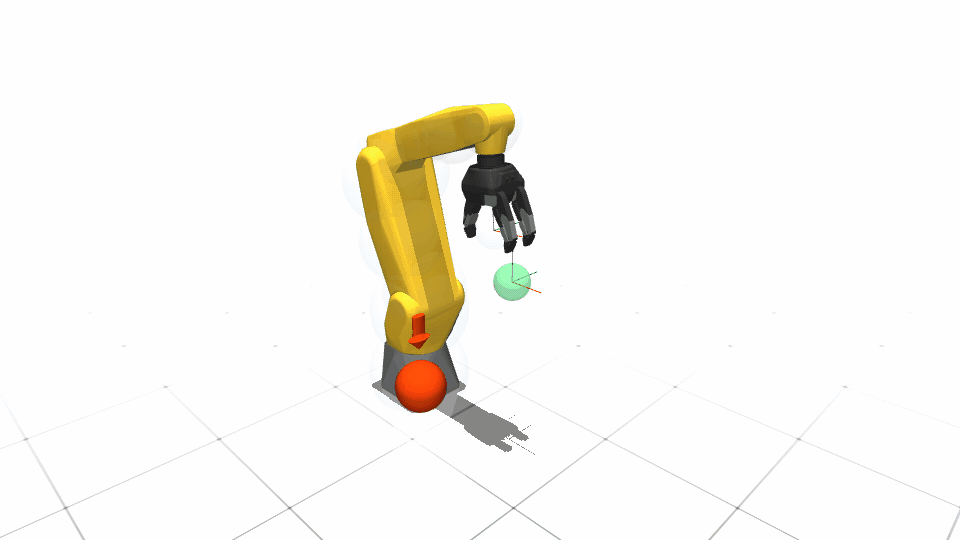

# FANUC LR Mate 200iD

| Configuration | DoFs | Controls | State dimension |
|---|---:|---:|---:|
| Single arm | 6 | 6 | 6 or 12 |
| Dual arm | 12 | 12 | 12 |

Single-arm configurations support first- and second-order dynamics and
collision-volume variants. Dual-arm operation uses first-order dynamics, with
and without collision volumes.

All six variants support MuJoCo and FANUC-specific scalar/tensor Isaac agent
classes backed by the shared declarative implementation.
The articulation is adapted from the ROS-Industrial FANUC Noetic LR Mate
200iD/7L description. Its BSD-3-Clause license, source revision, mesh choice,
and the SPARK-specific fixed/dual composition steps are recorded beside the
resource.

Generic configurations use robot-only assets, while legacy workpiece scenes
remain opt-in example resources. MuJoCo and Isaac both expose the Robotiq 3F
through the shared `[`/`]` open/close contract. The Isaac asset has nine
independently driven flexion joints whose open and closed targets match the
MuJoCo register mapping. Its official Robotiq convex-hull shapes cover the palm
and every phalanx, and all FANUC Isaac configurations enable physical
self-contact by default. Finger A is the fixed opposing finger; B and C are the
paired fingers. The dual Isaac embodiment composes two instances of the same
single-arm asset and retains independent left/right gripper commands.

Safe teleoperation and the robot-local Cartesian benchmark share link-local
collision geometry: 18 volumes for one arm and 34 for the dual-arm
configuration. The v0 benchmark samples Cartesian goals without obstacles;
v1 adds five independently resampled obstacles and the relaxed safety filter.
Because v1 uses a reactive safety filter rather than a path planner, a valid
outcome can be a timeout at a collision constraint when an obstacle blocks the
direct goal motion.
Every Isaac clone owns its goals, obstacles, completion counter, and reset
state. The default is ten resets with a 1,000-control-step episode limit.

## Demonstrations



The single-arm MuJoCo workflow is the curated release demonstration. The same
launchers below cover dual-arm and Isaac workflows.

```bash
# Single-arm safe teleoperation; replace mujoco with isaac as needed.
python example/fanuc_lrmate200id/run_fanuc_lrmate200id_teleop.py \
  --backend mujoco \
  --robot-config FanucLRMate200iDSingleArmDynamic1CollisionConfig

# Single-environment v1 Cartesian benchmark (viewer enabled by default).
python example/fanuc_lrmate200id/run_fanuc_lrmate200id_benchmark.py \
  --backend isaac \
  --robot-config FanucLRMate200iDSingleArmDynamic1CollisionConfig \
  --test-case arm_goal_static_v1 --profile-frequency

# Sixteen independent dual-arm v0 environments.
python example/fanuc_lrmate200id/run_fanuc_lrmate200id_benchmark.py \
  --backend isaac \
  --robot-config FanucLRMate200iDDualArmDynamic1CollisionConfig \
  --test-case arm_goal_static_v0 --num-envs 16 --profile-frequency
```

The qualified simulator timing is 5 ms physics with four physics steps per
20 ms control update. With `--dynamics-backend simulator`, the MuJoCo engine
uses its implicit-fast integrator to keep the articulated hand constraints
stable. With `--dynamics-backend model`, the FANUC first-order single
integrator owns state propagation and the viewer reports `SPARK model
(Euler)`; Euler is exact for its held joint-velocity command. These are two
different integration layers. See {doc}`../../architecture/dynamics_execution`
for the complete terminology and selection tables.

One Isaac environment defaults to CPU; multiple environments default to CUDA.
Add `--headless` for a non-rendering run. Press `V` to hide or show the overlay
without changing collision checking. Both entry points accept only FANUC LR
Mate configurations. `--enable-self-collision` optionally adds SPARK's
collision-volume self-pairs to the safe controller; it does not toggle the
always-configured PhysX contact setting.
