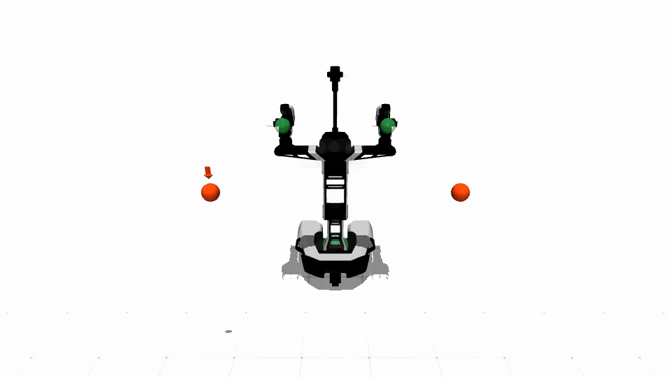

# Galaxea R1 Lite

| Configuration | DoFs | Controls | State dimension |
|---|---:|---:|---:|
| Right arm | 6 | 6 | 6 |
| Dual arm | 12 | 12 | 12 |
| Fixed base | 15 | 15 | 15 or 30 |
| Mobile base | 18 | 18 | 18 |

The fixed-base variants combine two arms with torso coordinates. Use the
right-arm or dual-arm variants when the torso must remain fixed; the fixed-base
variant intentionally exposes the torso to whole-upper-body IK.

All ten configurations support MuJoCo plus R1 Lite-specific scalar/tensor
Isaac agent classes backed by the shared declarative implementation. The
mobile-base x/y/yaw root is generated declaratively and rotates
robot-frame planar commands into the world-aligned simulator joints.
All R1 Lite configurations use the same qualified 5 ms physics step with four
substeps per 20 ms control cycle. The fixed-base model uses the same explicit
torque-actuator contract and joint parameters as the corresponding joints in
the dual-arm/mobile models; fixing the base does not select a separately tuned
robot. This retains the same 50 Hz simulated control period while improving
contact and drive integration resolution.

The 5-ms migration also makes an explicit benchmark hold preserve the nominal
torso targets instead of re-anchoring them to gravity-induced feedback. In the
16-environment CUDA qualification, maximum torso drift was 0.0045 rad. The
synchronized profiler measured 87.81 control steps/s for one CPU environment
and 35.87 steps/s for 16 CUDA environments (573.9 aggregate environment
steps/s). Thus the single environment is real-time capable; the profiled
16-clone workload is stable and batched but not wall-clock real time on the
release workstation.

MuJoCo and Isaac use the same bundled UV texture so the R1 Lite has consistent
colored materials in both backends. MuJoCo reads a lossless PNG conversion of
the source JPEG because its XML texture loader does not accept JPEG files. Its
scene retains the original white background, black-edged white ground grid,
and overhead lighting. Isaac RTX may still look more photorealistic because it
uses a different renderer.

The asset is adapted from Galaxea Dynamics' public R1 Lite 2025 description.
The source repository did not publish a license file when qualified; the
resource README records the exact source and that unresolved license caveat.

Safe teleoperation defaults to a 0.05 m environment clearance. Use the
39-volume right-arm, 62-volume dual-arm, or 80-volume sparse whole-body
fixed/mobile collision configuration for the workflows below. Both backends
expose the physical finger slides: select the right or left goal with `O` or `P`, then
press `[` to open or `]` to close that hand. The R1 MuJoCo scene does not
define named cameras, so these gripper keys cannot also cycle the native
viewer camera. Press `V` to hide or show collision volumes without changing
safety checks.

The benchmark uses the robot-neutral `arm_goal_static_v0/v1` and
`whole_goal_static_v0/v1` cases. A right-arm configuration consumes and renders
only the shared right goal; a dual-arm configuration consumes both shared arm
goals. Whole-goal cases require the mobile configuration, whose arm IK and
safety controls hold the torso at its nominal upright posture. The R1 launcher
adds only its embodiment-specific height/forward offset and gripper orientation,
so goals stay clear of the shoulder while the environment definitions remain
shared with other robots. v0 is obstacle-free goal reaching. Arm v1 samples five
obstacles and whole-body v1 samples ten; both enable relaxed safety filtering by
default. Isaac
uses the same task grounding for one environment and the batched tensor
runtime; every clone has independent goals, obstacles, episode counters, and
resets. The Isaac benchmark uses the same backend-neutral camera azimuth,
elevation, target, and field of view as MuJoCo. Parallel runs expand the camera
distance around the clone grid without rotating that view.

For right-arm cases, `right_arm_goal_static_v0/v1` are accepted as explicit
aliases of the shared `arm_goal_static_v0/v1` names.

## Demonstrations



The release keeps one mobile-base demonstration. Right-arm, dual-arm,
fixed-base, and Isaac workflows remain available through the same launchers.

## Safe teleoperation

```bash
# MuJoCo, right arm
python example/galaxea_r1lite/run_galaxea_r1lite_teleop.py \
  --backend mujoco \
  --robot-config GalaxeaR1LiteRightArmDynamic1CollisionConfig \
  --safe-algo rssa

# MuJoCo, dual arm
python example/galaxea_r1lite/run_galaxea_r1lite_teleop.py \
  --backend mujoco \
  --robot-config GalaxeaR1LiteDualArmDynamic1CollisionConfig \
  --safe-algo rssa

# MuJoCo, mobile base and dual arm
python example/galaxea_r1lite/run_galaxea_r1lite_teleop.py \
  --backend mujoco \
  --robot-config GalaxeaR1LiteMobileBaseDynamic1CollisionConfig \
  --safe-algo rssa

# Isaac, one right-arm environment (CPU is the single-environment default)
python example/galaxea_r1lite/run_galaxea_r1lite_teleop.py \
  --backend isaac \
  --robot-config GalaxeaR1LiteRightArmDynamic1CollisionConfig \
  --safe-algo rssa

# Isaac, one dual-arm environment
python example/galaxea_r1lite/run_galaxea_r1lite_teleop.py \
  --backend isaac \
  --robot-config GalaxeaR1LiteDualArmDynamic1CollisionConfig \
  --safe-algo rssa

# Isaac, one mobile-base environment
python example/galaxea_r1lite/run_galaxea_r1lite_teleop.py \
  --backend isaac \
  --robot-config GalaxeaR1LiteMobileBaseDynamic1CollisionConfig \
  --safe-algo rssa
```

The viewer is enabled by default. Add `--headless` only for unattended tests.

## Benchmarks

For MuJoCo or single-environment Isaac, select `--backend mujoco` or
`--backend isaac` and use one matching pair:

```bash
# Right arm, v0 (only the right shared goal is active)
python example/galaxea_r1lite/run_galaxea_r1lite_benchmark.py \
  --backend mujoco \
  --robot-config GalaxeaR1LiteRightArmDynamic1CollisionConfig \
  --test-case arm_goal_static_v0

# Right arm, v1
python example/galaxea_r1lite/run_galaxea_r1lite_benchmark.py \
  --backend mujoco \
  --robot-config GalaxeaR1LiteRightArmDynamic1CollisionConfig \
  --test-case arm_goal_static_v1

# Dual arm, v0
python example/galaxea_r1lite/run_galaxea_r1lite_benchmark.py \
  --backend mujoco \
  --robot-config GalaxeaR1LiteDualArmDynamic1CollisionConfig \
  --test-case arm_goal_static_v0

# Dual arm, v1
python example/galaxea_r1lite/run_galaxea_r1lite_benchmark.py \
  --backend mujoco \
  --robot-config GalaxeaR1LiteDualArmDynamic1CollisionConfig \
  --test-case arm_goal_static_v1

# Mobile base plus both arms, v0
python example/galaxea_r1lite/run_galaxea_r1lite_benchmark.py \
  --backend mujoco \
  --robot-config GalaxeaR1LiteMobileBaseDynamic1CollisionConfig \
  --test-case whole_goal_static_v0

# Mobile base plus both arms, v1
python example/galaxea_r1lite/run_galaxea_r1lite_benchmark.py \
  --backend mujoco \
  --robot-config GalaxeaR1LiteMobileBaseDynamic1CollisionConfig \
  --test-case whole_goal_static_v1
```

For a 16-environment Isaac run, change `--backend mujoco` to
`--backend isaac` and add `--num-envs 16 --device cuda:0`. The default is ten
episode resets with at most 1000 control steps per episode. Add
`--profile-frequency` to print synchronized stage timing. CUDA stage profiling
deliberately synchronizes asynchronous work at each boundary, so its reported
control rate is a diagnostic lower bound; omit it when measuring normal
throughput.

Both robot-local entry points accept only Galaxea R1 Lite configurations;
shared simulator and task components remain robot-neutral.
