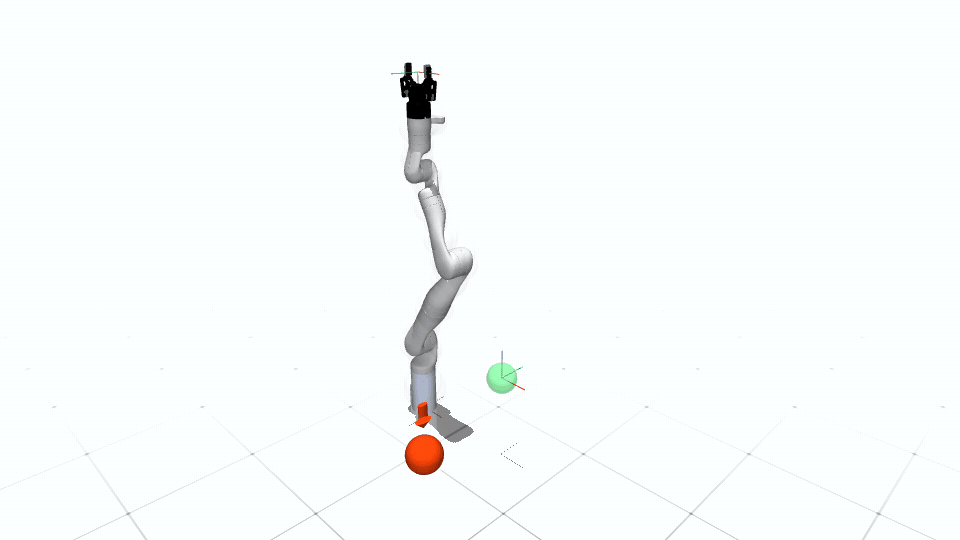

# Kinova Gen3

| Configuration | DoFs | Controls | State dimension |
|---|---:|---:|---:|
| Single arm | 7 | 7 | 7 or 14 |
| Dual arm | 14 | 14 | 14 |

Single-arm first- and second-order configurations are available with optional
collision volumes. The dual-arm configuration uses first-order dynamics. All
six variants support MuJoCo and Kinova-specific scalar/tensor Isaac agent
classes backed by the shared declarative articulation implementation,
including CUDA cloned environments.

Generic configurations use robot-only simulator assets, so loose objects from
the legacy manipulation scenes are not spawned during reset. MuJoCo and Isaac
both display the Robotiq 2F-85 and expose it through the shared `[`/`]`
open/close contract. Isaac uses two lightweight auxiliary finger joints that
approximate the coupled four-bar travel without changing the robot's seven arm
DoFs. The Isaac display gripper intentionally adds no collision geometry.

The simulator's seven-DoF arm URDF and Gen3 meshes are verified against
Kinova Robotics' official `ros_kortex` description. The imported arm chain
changes only ROS package mesh URLs to repository-relative paths; SPARK then
attaches the lightweight articulated display gripper described above. Exact
revision, byte-level comparison scope, license, and the unaudited
Robotiq/MuJoCo asset boundary are recorded in
`module/spark_robot/resources/kinova_gen3/README.md`. In teleoperation, press
`O` to select the right-arm goal or `P` to select the left-arm goal, then `[` to
open and `]` to close that gripper. With no arm goal selected, the command is
applied to every available Kinova gripper.

Safe teleoperation and the robot-local Cartesian benchmark share link-local
collision geometry: 47 volumes for one arm and 90 for the dual-arm
configuration. Both backends therefore use the same sphere radii and offsets.
The v0 benchmark samples collision-free Cartesian goals; v1 adds five
independently resampled obstacles and the relaxed safety filter. Each Isaac
clone owns its goals, obstacles, completion counter, and reset state. The
default is ten resets with a 1,000-control-step episode limit.

Kinova keyboard control uses the original explicit Cartesian home: `[0.4,
0.0, 0.3]` for a single arm and `[0.4, +/-0.3, 0.5]` for the dual-arm form.
Each home has identity end-effector orientation. Because the Robotiq flange
reverses its local tool axis, that identity pose points the physical gripper
downward. Kinova IK applies the limits declared by its robot configuration, so
the solver cannot satisfy that pose with a multi-turn joint solution.

Benchmark goals use the same identity/gripper-down convention, sample at
0.28--0.42 m, and require both a 5 cm position error and a 0.1 rad orientation
error before an episode is reported successful. The v1 obstacle height range
is 0.20--0.60 m. MuJoCo's resets keep obstacles 0.17 m from the robot, outside
the default 0.15 m safety activation band with a 2 cm geometry-mapping margin.
Dual-arm resets additionally keep the two end-effector targets at least 0.25 m
apart. The dual-arm Isaac articulation enables physical self-contact, so the
two arms cannot pass through one another; single-arm Kinova configurations
retain the simulator default because no inter-arm pair exists.
MuJoCo's position servos include generalized bias-force feed-forward, so a
zero velocity command holds the arm against gravity while MuJoCo remains the
state owner. The adapter converts the desired joint velocity into the affine
position actuator's equivalent velocity feed-forward, retaining damping while
allowing both first- and second-order simulator dynamics to track their motion
commands. Its passive Robotiq four-bar joints also use modest damping and
armature to suppress equality-constraint chatter without changing the gripper
travel or control contract. Teleoperation selects a first- or second-order
safety index automatically when `--safety-index` is omitted. The adapter also
bounds the requested affine actuator force inside the engine limit, preserving
implicit servo damping across MuJoCo 3.4 and Isaac Sim's MuJoCo 3.8 runtime.
The Isaac tensor benchmark follows the same feedback-anchored integration
contract, with a Kinova-specific Cartesian tracking gain chosen to overcome
gravity without accumulating a joint-position target past the requested pose.

## Demonstrations



The release keeps the single-arm MuJoCo recording as the representative
Kinova demonstration. Dual-arm and Isaac workflows use the launchers below.

```bash
# Single-arm safe teleoperation; replace mujoco with isaac as needed.
python example/kinova_gen3/run_kinova_gen3_teleop.py \
  --backend mujoco \
  --robot-config KinovaGen3SingleArmDynamic1CollisionConfig

# Single-environment v1 Cartesian benchmark (viewer enabled by default).
python example/kinova_gen3/run_kinova_gen3_benchmark.py \
  --backend isaac \
  --robot-config KinovaGen3SingleArmDynamic1CollisionConfig \
  --test-case arm_goal_static_v1 --profile-frequency

# Sixteen independent dual-arm v0 environments.
python example/kinova_gen3/run_kinova_gen3_benchmark.py \
  --backend isaac \
  --robot-config KinovaGen3DualArmDynamic1CollisionConfig \
  --test-case arm_goal_static_v0 --num-envs 16 --profile-frequency
```

The qualified simulator timing is 5 ms physics with four substeps per 20 ms
control update. One Isaac environment defaults to CPU; multiple environments
default to CUDA. Add `--headless` for a non-rendering run. Press `V` in an
interactive window to hide or show collision volumes without changing safety
checking. Both entry points accept only Kinova Gen3 configurations.
