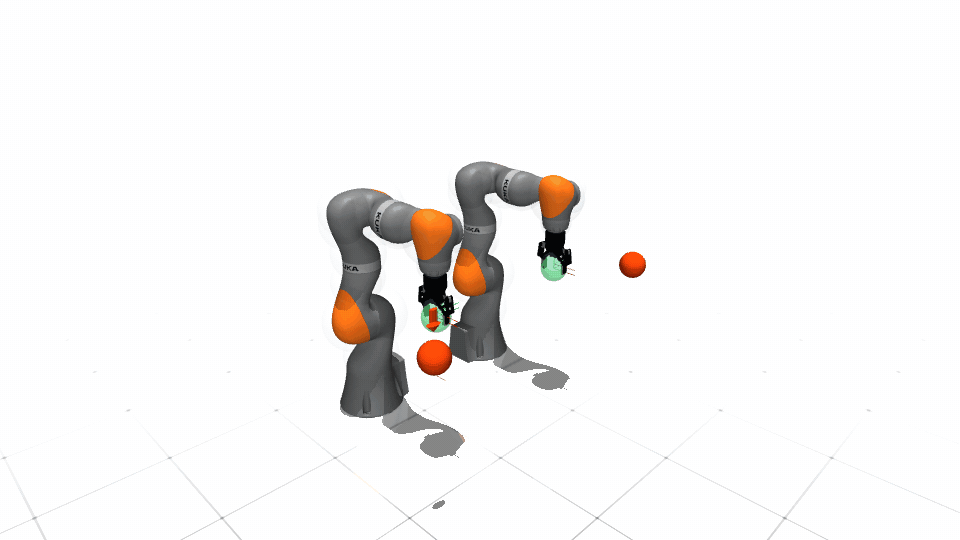

# KUKA iiwa 14

| Configuration | DoFs | Controls | State dimension |
|---|---:|---:|---:|
| Single arm | 7 | 7 | 7 or 14 |
| Dual arm | 14 | 14 | 14 |

Single-arm configurations support first- and second-order dynamics and
collision-volume variants. Dual-arm operation uses a fourteen-dimensional
first-order configuration, with and without collision volumes. All six variants support MuJoCo and KUKA-specific
scalar/tensor Isaac agent classes backed by the shared declarative
articulation implementation.

Generic configurations use robot-only assets in both simulators. Each backend
displays the same Robotiq 2F-85. MuJoCo exposes its articulated actuator and
uses the shared `[`/`]` open/close contract. Isaac uses two lightweight
prismatic display joints to expose the same open/close interaction without
adding gripper joints to SPARK's seven-DoF arm state. Dual-arm Isaac enables
physical self-contact so the two manipulators cannot pass through each other.
The single- and dual-arm MuJoCo scenes use the same white sky, black/white
checker floor, reflectance, and lighting. Renderer-only procedural assets are
kept separate from robot geometry so both MuJoCo and Pinocchio load the model.

Safe teleoperation and the robot-local Cartesian benchmark share link-local
collision geometry: 19 volumes for one arm and 38 for the dual-arm
configuration. The Isaac articulation root applies the declared fixed-base
alignment, so Cartesian goals, collision spheres, and viewer orientation agree
with MuJoCo. The canonical benchmark names are `arm_goal_static_v0` and
`arm_goal_static_v1`. V0 samples Cartesian arm goals without obstacles; v1
adds five independently resampled obstacles and the relaxed safety filter.
Both cases require the KUKA tool frame to satisfy position and orientation.
The single-arm workspace spans x `[0.20, 0.65]`, y `[-0.40, 0.40]`, and z
`[0.20, 0.70]` metres, and every reset target is at least 0.25 m from the home
tool position. Dual-arm goals use separated left/right halves of that
workspace and retain at least 0.25 m pair separation. Reset-time IK validation
gives scalar MuJoCo and tensor Isaac the same feasible task subset. V1
obstacles are concentrated in the swept arm workspace rather than spending
samples behind the fixed base. Tensor Isaac applies the same link-7-to-tool
transform used by KUKA kinematics. Scalar Isaac feedback removes the URDF's
fixed -90-degree asset calibration from the logical base frame, preventing
collision volumes from being rotated a second time during teleoperation.
Every Isaac clone owns its goals, obstacles, completion counter, and reset
state. A faster clone continues receiving physical resets and fresh task
samples while slower clones finish; the batch ends together after every clone
has completed the requested quota. The default is ten completed episodes per
clone with a 1,000-control-step episode limit. Use `--num-resets -1` for
continuous reset and resampling until the viewer is closed.

## Demonstrations



The release keeps the dual-arm MuJoCo recording as the representative KUKA
demonstration. Single-arm and Isaac workflows use the same launchers below.

```bash
# Single-arm safe teleoperation; replace mujoco with isaac as needed.
python example/kuka_iiwa14/run_kuka_iiwa14_teleop.py \
  --backend mujoco \
  --robot-config KukaIIWA14SingleArmDynamic1CollisionConfig

# Single-environment v1 Cartesian benchmark (viewer enabled by default).
python example/kuka_iiwa14/run_kuka_iiwa14_benchmark.py \
  --backend isaac \
  --robot-config KukaIIWA14SingleArmDynamic1CollisionConfig \
  --test-case arm_goal_static_v1 --profile-frequency

# Sixteen independent dual-arm v0 environments.
python example/kuka_iiwa14/run_kuka_iiwa14_benchmark.py \
  --backend isaac \
  --robot-config KukaIIWA14DualArmDynamic1CollisionConfig \
  --test-case arm_goal_static_v0 --num-envs 16 --profile-frequency

# Dual-arm safe teleoperation with overview RGB and depth windows.
python example/kuka_iiwa14/run_kuka_iiwa14_teleop.py \
  --backend mujoco \
  --robot-config KukaIIWA14DualArmDynamic1CollisionConfig \
  --dynamics-backend simulator --safe-algo rssa --enable-camera
```

The qualified simulator timing is 5 ms physics with four substeps per 20 ms
control update. This preserves the 50 Hz controller while improving contact
and drive integration in MuJoCo and Isaac. KUKA's MuJoCo affine
servos use bounded 2,000-gain position drives, velocity feed-forward, and
gravity/bias compensation. Isaac uses the same 2,000-gain target stiffness
with damping tuned for the iiwa 14 payload, while the passive 2F-85 linkage is
damped to avoid visible chatter. One Isaac environment defaults to CPU;
multiple environments default to CUDA. Add `--headless` for a non-rendering
run. Press `V` to change only collision-volume visibility. Use `O`/`P` to
select the right/left goal and `[`/`]` to open/close that selected gripper.
Both entry points accept only KUKA iiwa configurations.

Add `--profile-frequency` to either benchmark backend. With `--real-time`,
the reported effective rate should track the configured 50 Hz loop; without
it, the report measures maximum computational throughput. Parallel Isaac
defaults to one viewport update per ten control steps so rendering does not
silently dominate the batched controller; `--render-every` can override that
presentation cadence. A synchronized headless 16-environment v0 qualification
measured 68.18 control steps/s (1090.9 aggregate environment steps/s) with the
four-by-5-ms schedule on the release workstation.
