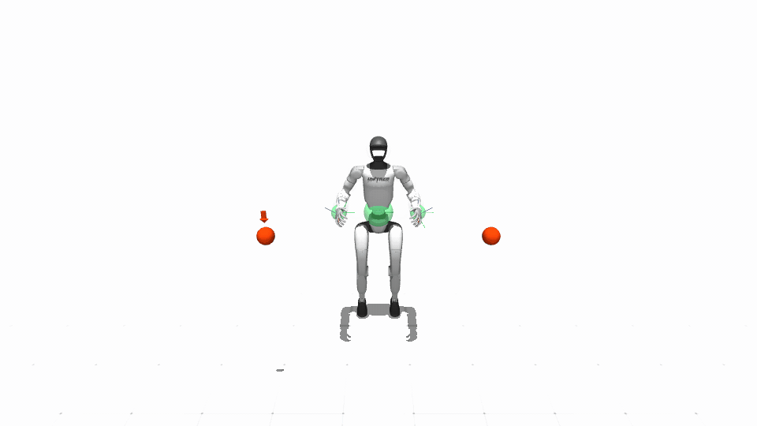
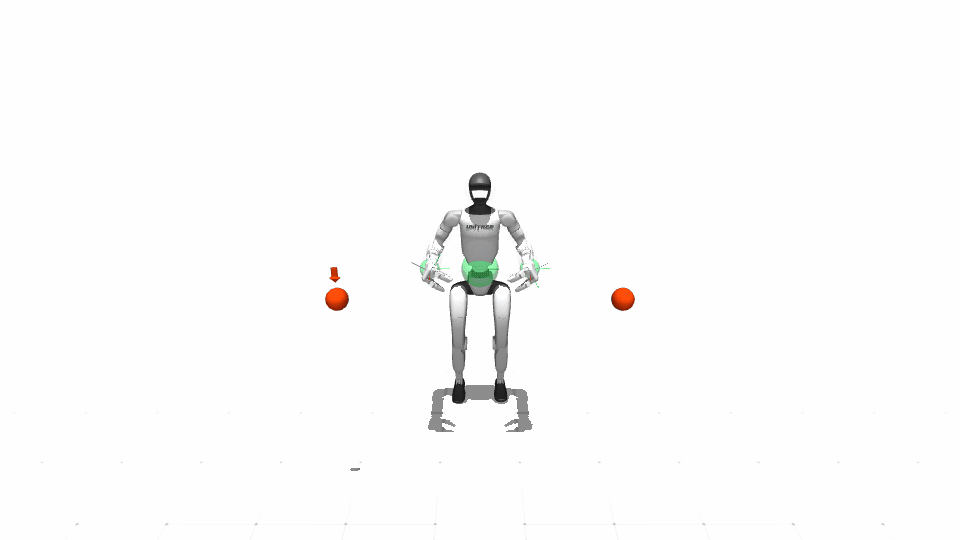
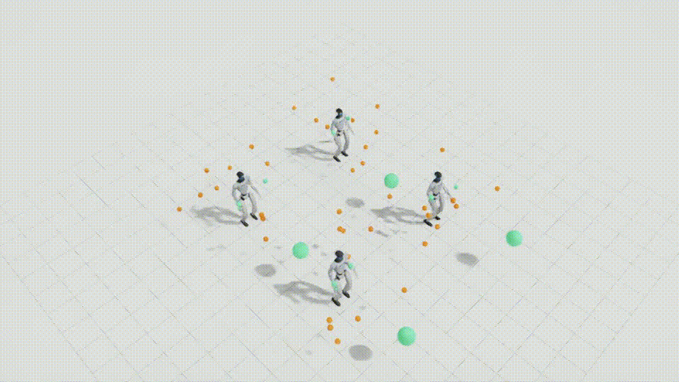

# Unitree G1

## Configurations

| Configuration | DoFs | Controls | State dimension |
|---|---:|---:|---:|
| Right arm | 7 | 7 | 7 or 14 |
| Dual arm | 14 | 14 | 14 or 28 with supported hand variant |
| Fixed base | 17 | 17 | 17 or 34 |
| Mobile base | 20 | 20 | 20 or 40 |
| Whole body | 36 | 29 | 36 or 71 |
| Whole body with hands | variant-specific | 29 | variant-specific |

Configurations cover right arm, dual arm, dual arms plus waist, planar mobile
base, and floating whole body. Hand variants add actuation resources where
supported. Collision volumes, frame enumerations, limits, and kinematics are
selected with the configuration.

Unitree G1 is currently the only robot family with released MuJoCo, Isaac, and
hardware mappings. The hardware path remains optional and requires the Unitree
SDK, target-machine network configuration, and an independently validated
emergency-stop procedure. Other SPARK robot families retain the same robot,
task, policy, and MuJoCo contracts without inheriting these G1 dependencies.

The real agent may optionally mirror hardware feedback in a non-physical
MuJoCo digital-twin viewer. `--use-real true` selects hardware; the twin is a
secondary presentation backend and never owns commands or feedback:

```bash
# Real agent with the backward-compatible MuJoCo twin enabled.
python example/unitree_g1/run_unitree_g1_teleop.py \
  --use-real true \
  --enable-digital-twin true --digital-twin-backend mujoco \
  --digital-twin-sync-hz 500 --net YOUR_INTERFACE --send-cmd false

# Real agent without a viewer twin.
python example/unitree_g1/run_unitree_g1_teleop.py \
  --use-real true \
  --enable-digital-twin false --net YOUR_INTERFACE --send-cmd false
```

The twin currently supports MuJoCo only. Its contacts are disabled because it
is a visualization of measured hardware state, not a second physical plant.
Use `--send-cmd false` for a dry communication/feedback check before allowing
the hardware path to publish commands.

## Demonstrated configurations

<table>
  <tr>
    <td align="center"><b>Whole-body WBT</b><br></td>
    <td align="center"><b>Whole-body Sport</b><br></td>
  </tr>
  <tr>
    <td align="center" colspan="2"><b>Whole-body SONIC parallel benchmark</b><br></td>
  </tr>
</table>

These three recordings represent the WBT, Sport, and SONIC execution paths in
the compact release media set. Right-arm, dual-arm, fixed-base, mobile-base,
and additional backend combinations remain covered by executable workflows
and the numerical support matrix.

## Execution modes

All Unitree G1 simulation configurations use four 5 ms physics steps per
control update.  The resulting 20 ms control period (50 Hz) matches the real
agent's command period while retaining simulator substeps for contact and
joint-servo stability.  MuJoCo, scalar Isaac, and tensor Isaac read this
schedule from the selected robot configuration; changing it in an individual
launcher is unsupported because it would make the same policy run at a
different control rate.

On the release workstation, a 200-step headless `whole_goal_static_v1` run
with RSSA and the full physical self-contact model measured 50.01 Hz in
MuJoCo, 33.58 Hz in Isaac on CUDA, and 26.41 Hz in Isaac on CPU. CPU therefore
is not the one-environment WBT benchmark default: it makes PhysX stepping
faster but makes the small-batch WBT and tensor-safety operations substantially
slower. These are wall-clock throughput measurements, distinct from the exact
50 Hz simulated control clock; the safety-filtered Isaac stack cannot be
claimed as hard real time on that machine.

The following table records workflow maturity rather than merely whether a
backend class exists.

| Workflow | MuJoCo | Isaac | Status |
|---|---:|---:|---|
| WBT, one environment | Yes | Yes | Supported |
| WBT, parallel environments | Isolated processes | Tensor execution | Shared one/parallel plant; validated with independent resets |
| Mobile base, single/parallel | Yes | Experimental tensor execution | Isaac validated at 1 and 64 environments |
| SONIC deployment stack | Experimental | Yes | Shared server validated at 4, 16, 32, and 64 environments |
| SONIC planner-free reference tracking | No | Experimental tensor execution | Native policy validated at 4,096 rows; upstream reference required |
| Sport Mode, one/parallel | Experimental | Experimental tensor execution | Validated at 4 Isaac environments |
| Headless benchmark recording | Yes | Yes | MP4 and optional GIF |

WBT teleoperation and WBT benchmarks use the same tensor runner and the
content-addressed USD imported from SPARK's local URDF; no remote vendor USD
is required. The physics and actuation adaptation follows
`OpenWBT's Isaac deployment <https://github.com/GalaxyGeneralRobotics/OpenWBT/blob/main/deploy/controllers/controller_isaacsim.py>`_:
native position drives, the named WBT gain profile, 0.01 lower-body/waist and
0.001 arm armatures, half-mass wrist links, four position and zero velocity
solver iterations, a 5 ms physics step, and four-step control decimation.
SPARK additionally enables physical articulation self-contact so the hands,
arms, legs, and torso cannot pass through one another. This physical setting
is independent of `--enable-self-collision`, which controls SPARK's
collision-volume safety constraints. These settings apply to one or many
Isaac environments. Interactive one-environment teleoperation can use its
scalar feedback/action boundary, but learned Isaac benchmarks use the same
CUDA tensor path for one and many environments. Neither environment count
changes the WBT plant. Imported shaders are normalized to a nonmetallic finish
without replacing their link colors.

MuJoCo and Isaac benchmark resets use one backend-neutral NumPy scenario
stream. The tuple `(seed, environment index, episode index)` determines the
arm goals, base goal, and complete obstacle layout; Torch device and simulator
backend do not participate in sampling. Each reset prints a scenario seed and
fingerprint. Matching fingerprints mean that both backends received exactly
the same task geometry—for example, public seed 0 begins with scenario seed 1
and then seed 2 after the first reset. Parallel environment streams use a
fixed non-overlapping seed stride while preserving this same per-row rule.

During a whole-goal benchmark, each environment tracks its Cartesian arm goal
through the normal target-rate limiter while the learned locomotion expert
moves the base. Base arrival is still latched after 50 consecutive control
steps inside the SE(2) tolerance, but it does not gate arm tracking. The
optional `--hold-arm-goals-during-locomotion` switch restores sequential base
then arm tracking for a diagnostic run. Safety corrections are applied only
to the active waist, left-arm, or right-arm branch, which prevents a
rear-torso constraint from overwriting both arm targets and disturbing the
learned balance command.

Sport and deployment-backed SONIC also use tensor execution, but keep their
own policy-specific actuation adaptations. The shared SONIC server retains
independent session state but executes the released batch-one
planner/encoder/decoder graphs sequentially.
The separate planner-free native adapter executes dynamic-batch encoder and
decoder exports directly on CUDA; it requires an upstream ten-frame full-body
reference and is not a velocity-command locomotion stack. See
{doc}`../policy/native_sonic` for that interface and its throughput gate.

## WBT benchmark commands

Single-environment MuJoCo goal reaching:

```bash
python example/unitree_g1/run_unitree_g1_benchmark.py \
  --robot-config UnitreeG1WholeBodyDynamic1Config \
  --policy-config UnitreeG1WBTSafePolicy \
  --backend mujoco --num-envs 1 \
  --test-case base_goal_static_v0
```

Obstacle avoidance with relaxed safe-set control:

```bash
python example/unitree_g1/run_unitree_g1_benchmark.py \
  --robot-config UnitreeG1WholeBodyDynamic1Config \
  --policy-config UnitreeG1WBTSafePolicy \
  --backend mujoco --num-envs 1 \
  --test-case base_goal_static_v1 \
  --safe-algo rssa --use-sim-dynamics \
  --render-robot-collision-volumes --profile-frequency
```

Four independent headless MuJoCo environments:

```bash
python example/unitree_g1/run_unitree_g1_benchmark.py \
  --robot-config UnitreeG1WholeBodyDynamic1Config \
  --policy-config UnitreeG1WBTSafePolicy \
  --backend mujoco --num-envs 4 \
  --test-case base_goal_static_v0 \
  --safe-algo bypass --use-sim-dynamics \
  --headless --profile-frequency
```

Each MuJoCo worker owns its simulator, task state, recurrent policy state, and
seed. Environments reset independently. Parallel MuJoCo execution is headless;
use the recording tool below for a tiled visualization.

The corresponding single-environment Isaac comparison is:

```bash
OMNI_KIT_ACCEPT_EULA=YES python example/unitree_g1/run_unitree_g1_benchmark.py \
  --robot-config UnitreeG1WholeBodyDynamic1Config \
  --policy-config UnitreeG1WBTSafePolicy \
  --backend isaac --num-envs 1 \
  --test-case base_goal_static_v0
```

Learned Isaac policies use CUDA for both one and many environments, so a
one-environment tuning run exercises the same policy path used at scale. See
{doc}`../../tutorials/benchmarking_and_recording` for the complete benchmark
and GPU qualification procedures.

## WBT camera teleoperation

The WBT simulation agents expose the same torso-mounted RGB-D camera in
MuJoCo and Isaac. `--enable-camera` opens separate RGB and depth windows:

```bash
python example/unitree_g1/run_unitree_g1_teleop.py \
  --backend mujoco --policy-config UnitreeG1WBTPolicy \
  --robot-config UnitreeG1WholeBodyWithHandDynamic1Config \
  --safe-algo rssa --enable-camera
```

Replace `--backend mujoco` with `--backend isaac` to use the native Isaac RGB-D
head sensor. Add `--no-camera-display` when only `camera_feedback` is needed.

## Headless recording

`tools/record_benchmark.py` runs the real benchmark headlessly and records its
robot, goals, obstacles, collision volumes, and safety colors. Output timing is
based on simulated control time.

```bash
python tools/record_benchmark.py \
  --robot-config UnitreeG1WholeBodyDynamic1Config \
  --policy-config UnitreeG1WBTSafePolicy \
  --test-case base_goal_static_v1 \
  --backend mujoco --num-envs 1 --safe-algo rssa \
  --duration 8 --fps 25 --resolution 1280 720 \
  --camera-azimuth 145 --camera-elevation -20 \
  --output build/media/wbt_v1.mp4 \
  --gif build/media/wbt_v1.gif
```

For parallel MuJoCo, each environment is recorded in its worker process and
the tool creates a tiled result. Isaac recording captures the tensor-world
viewport and selects an overview camera. A `.command.txt` file is written
beside each MP4 for reproduction.

## Assets and further guides

MJCF models live under `module/spark_robot/resources/unitree_g1/mjcf`, URDF
models under `module/spark_robot/resources/unitree_g1/urdf`, and both use the
canonical mesh set under `module/spark_robot/resources/unitree_g1/meshes`.
Isaac imports the matching URDF into a content-addressed USD cache and maps
articulation joints by name.

Unitree safe teleoperation and tensor safety now use the same 0.05 m default
environment clearance and distance-based collision-volume colors as the other
robot families. `V` toggles the overlay in MuJoCo, scalar Isaac, and the
in-process tensor Isaac viewer; it does not disable the sparse collision model.

- {doc}`../../tutorials/teleoperation`: interactive simulation and keyboard
  controls;
- {doc}`../agent/isaac`: Isaac setup and tensor execution;
- {doc}`../agent/mujoco`: MuJoCo dynamics and viewer behavior;
- {doc}`../policy/native_sonic`: planner-free GPU-native SONIC;
- {doc}`../../tutorials/showcase`: G1 and multi-robot demonstrations.
