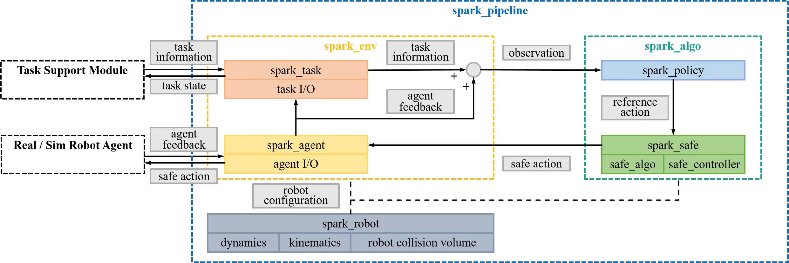

# Spark

## Installation

### 1.Minimal

Choose one to follow depending on your OS.

#### 💻 Ubuntu 20.04

With conda available but **NO** conda env (e.g., base) activated, run one of the following.

If no ROS-related utilities are used:
```zsh
./install.sh --name <env_name>
```
If ROS is needed in running pipelines:
```zsh
./install.sh --ros --name <env_name>
```
To remove installed environment:
```zsh
conda remove --name <env_name> --all
```

#### ⌘ MAC OS

Follow the same steps as the instruction above for Ubuntu 20.04. Use `mjpython` instead of `python` to run scripts which use Mujoco.

### 2. Hardware deployment

#### Unitree G1
```zsh
# Clone and install the unitree_sdk2_python package separately
cd ~  # Move to the home directory or any other directory outside SafeG1
git clone https://github.com/unitreerobotics/unitree_sdk2_python.git
cd unitree_sdk2_python
pip install -e .
```

<!-- #### Dependencies
- Python == 3.8
- rospy
- casadi
- meshcat
- numpy
- opencv-python
- pinocchio == 3.1.0 -->

---
## Quick Start

After installation, try running a implemented pipeline in [Pipeline Overview](#Pipeline-Overview).
A quick example is:
```
python example/run_g1_safe_teleop_sim.py
```
---
## Pipeline Overview

| | Task | Policy | Safety | Agent |
|-|-|-|-|-|
| [Safe G1 teleoperation](pipeline/spark_pipeline/g1_safe_teleop/readme.md) | Hands-only teleop; obstacles (ROS, debug) | IK + PID |  SSA/CBF/etc. | G1 real, G1 mujoco |
| [Safe G1 benchmark](pipeline/spark_pipeline/g1_benchmark/readme.md) | Dynamic goal tracking with collision avoidance | IK + PID | SSA/CBF/etc. | G1 mujoco |


---
## Infrastructure



### [Wrapper] spark_env

Environment wrapper aligning with env-algo structure. Composed of the following two modules.

#### 1. [Module] spark_task

Task class, receiving additional sensory data and generating objectives.
Returns global info (e.g., robot base in world frame).
Task runs for a maximal number of steps (-1 for continuous tasks).

#### 2. [Module] spark_agent

Ultimate interface to the robot for both sim and real. Each agent implements robot-specific interfaces for receiving observations (e.g., robot states, sensory data) and publishing control (e.g., robot joint positions) for both simulation and real robots.
Returns local info (e.g., robot state). Global info can also be returned if available (e.g., global localization by robot).

### [Wrapper] spark_algo

Algorithm wrapper aligning with env-algo structure. Composed of the following two modules if model-based safe control is used.

#### 1. [Module] spark_policy

Policies fulfilling task-specific objectives.

#### 2. [Module] spark_safe

- `safe_algo`: core module implementing safe control methods and energy functions.
- `safe_controller`: interface to safe control algorithms.

#### NOTE

For end-to-end safe algorithms, set `safe_controller` in pipeline configuration to `ByPassSafeControl` and implement safe algorithms in `spark_policy`. An example of disabling `safe_controller` is
```
python example/run_g1_unsafe_teleop_sim.py
```
The script is essentially [Safe G1 teleoperation](pipeline/spark_pipeline/g1_safe_teleop/readme.md) without safe control module.

### [Module] spark_robot

Robot library containing robot config (e.g., state, dofs, urdf).

### [Runner] spark_pipeline

Top level pipelines for safe robotic tasks.
Pipeline runs for a maximal number of steps (-1 for unlimited).
When env is done, pipeline can choose to reset the env or exit.

---

**⚠️ Full support of obstacle geometries will be available in later updates.**

