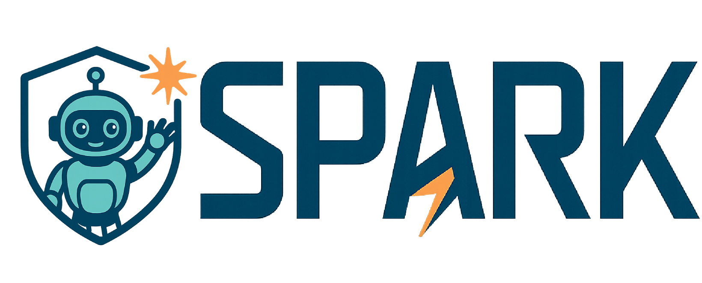
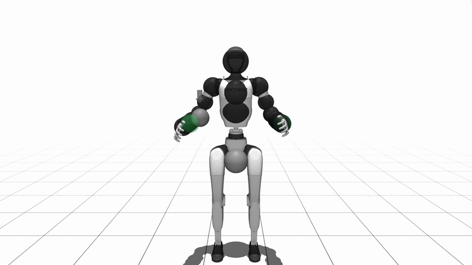

<div align="center">
  
</div>
<p align="center">
  <a href="https://github.com/intelligent-control-lab/spark#%EF%B8%8F-1-installation">Installation</a> |
  <a href="https://github.com/intelligent-control-lab/spark#-2-quick-start">Quick Start</a> |
  <a href="https://github.com/intelligent-control-lab/spark#-3-infrastructure">Infrastructure</a> |
  <a href="https://github.com/intelligent-control-lab/spark#-4-contributing">Contributing</a>
</p>
---

Safe Protective and Assistive Robot Kit (SPARK) offers configurable trade-offs between safety and performance, enabling it to accommodate diverse user needs. Its modular architecture and user-friendly APIs ensure seamless integration with a wide range of tasks, hardware platforms, and customization requirements. Additionally, SPARK provides a simulation environment featuring diverse humanoid-safe control tasks, serving as benchmark baselines. By leveraging SPARK, researchers and practitioners can accelerate humanoid robotics development while maintaining strong guarantees on hardware and environmental safety.

This project also serves as the homework platform for Carnegie Mellon University's graduate course [16-883: Provably Safe Robotics](http://icontrol.ri.cmu.edu/course/16-883spring2025.html), which focuses on the design and verification of safe robotic systems through planning, learning, control, and formal verification techniques. 

For more information, please visit our [project website](https://intelligent-control-lab.github.io/spark/). If you find this code useful, consider citing our [paper](https://arxiv.org/pdf/2502.03132):

```bibtex
@article{
  sun2025spark,
  title={SPARK: A Modular Benchmark for Humanoid Robot Safety},
  author={Sun, Yifan and Chen, Rui and Yun, Kai S and Fang, Yikuan and Jung, Sebin and Li, Feihan and Li, Bowei and Zhao, Weiye and Liu, Changliu},
  journal={arXiv preprint arXiv:2502.03132},
  year={2025}
}
```
<div align="center">
  
</div>


## 🛠️ 1 Installation

### 1.1 Minimal

Choose one to follow depending on your OS.

#### 💻 Ubuntu 20.04

With conda available but **NO** conda env (e.g., base) activated, run one of the following.

If no ROS-related utilities are used:
```zsh
./install.sh --name <env_name>
```
If ROS is needed in running pipelines:
```zsh
./install.sh --ros --name <env_name>
```
To remove installed environment:
```zsh
conda remove --name <env_name> --all
```

#### ⌘ MAC OS

Follow the same steps as the instruction above for Ubuntu 20.04. Use `mjpython` instead of `python` to run scripts which use Mujoco.

### 1.2 Hardware deployment
This step is only necessary if you plan to deploy on a real robot. Otherwise, you can skip it.

#### Unitree G1
```zsh
# Clone and install the unitree_sdk2_python package separately
cd ~  # Move to the home directory or any other directory outside SafeG1
git clone https://github.com/unitreerobotics/unitree_sdk2_python.git
cd unitree_sdk2_python
pip install -e .
```

---
## 🚀 2 Quick Start

### 2.1 Safe Teleoperation Pipeline
After installation, try running a implemented [safe teleoperation pipeline](#341-g1safeteleoppipeline).
A quick example is:
```
python example/run_g1_safe_teleop_sim.py
```

### 2.2 Benchmark Pipeline
To run a implemented [benchmark pipeline](#342-g1benchmarkpipeline), you can run:
```
python example/run_g1_benchmark.py
```

### 2.3 Configure Your Pipeline
To create a pipeline based on the benchmark configuration, you can follow the example below to test the Control Barrier Function (CBF) on a fixed-base humanoid robot.
First, import necessary modules:
```python
from spark_pipeline import G1BenchmarkPipeline as Pipeline
from spark_pipeline import G1BenchmarkPipelineConfig as PipelineConfig
from spark_pipeline import generate_g1_benchmark_test_case
```
Then load and customize the pipeline configuration
```python
# Initialize the configuration
cfg = PipelineConfig()

# Load a predefined configuration for a fixed-base robot with first-order dynamics,
# targeting arm goals amidst dynamic obstacles
cfg = generate_g1_benchmark_test_case(cfg, "G1FixedBase_D1_AG_DO_v0")

# Set the safety algorithm to Control Barrier Function and configure its parameters
cfg.algo.safe_controller.safe_algo.class_name = "BasicControlBarrierFunction"
cfg.algo.safe_controller.safe_algo.lambda_cbf = 1.0
cfg.algo.safe_controller.safe_algo.control_weight = [
    1.0, 1.0, 1.0,  # Waist joints
    1.0, 1.0, 1.0, 1.0, 1.0, 1.0, 1.0,  # Left arm joints
    1.0, 1.0, 1.0, 1.0, 1.0, 1.0, 1.0,  # Right arm joints
    # Locomotion joints are omitted for fixed-base configuration
]

# Define the minimum distance to maintain from the environment
cfg.algo.safe_controller.safety_index.min_distance["environment"] = 0.1

# Select metrics to log during execution
cfg.metric_selection.dist_robot_to_env = True
```

Finally,  initialize and run the pipeline:
```python
# Create the pipeline instance with the specified configuration
pipeline = Pipeline(cfg)

# Run the pipeline
pipeline.run()
```

---
## 🧩 3 Infrastructure


### 🌎 3.1 [Wrapper] spark_env

Environment wrapper aligning with env-algo structure. Composed of the following two modules.

#### 🎯 3.1.1 [Module] spark_task

Task class, receiving additional sensory data and generating objectives.
Returns global info (e.g., robot base in world frame).
Task runs for a maximal number of steps (-1 for continuous tasks).
Currently supported tasks are listed below:
|Task Class| Description |
|-|-|
| [G1TeleopSimTask](module/spark_task/spark_task/task/g1_teleop_sim/g1_teleop_sim_task.py) | Obstacle and robot goals can be controlled online via keyboard input |
| [G1BenchmarkTask](module/spark_task/spark_task/task/g1_benchmark/g1_benchmark_task.py) | Obstacle and robot goals follow predefined trajectories |

#### 🤖 3.1.2 [Module] spark_agent

Ultimate interface to the robot for both sim and real. Each agent implements robot-specific interfaces for receiving observations (e.g., robot states, sensory data) and publishing control (e.g., robot joint positions) for both simulation and real robots.
Returns local info (e.g., robot state). Global info can also be returned if available (e.g., global localization by robot).
Currently supported agents are listed below:
|Agent Class| Description |
|-|-|
| [G1RealAgent](module/spark_agent/spark_agent/real/g1/g1_real_agent.py) | Supports deployment on a real robot using the Unitree G1 SDK |
| [G1MujocoAgent](module/spark_agent/spark_agent/simulation/mujoco/g1_mujoco_agent.py) | Supports simulation in the MuJoCo environment |

### 📝 3.2 [Wrapper] spark_algo

Algorithm wrapper aligning with env-algo structure. Composed of the following two modules if model-based safe control is used.

#### 💡 3.2.1 [Module] spark_policy

Policies fulfilling task-specific objectives.
Currently supported policies are listed below:
|Policy Class| Description |
|-|-|
| [G1TeleopPIDPolicy](module/spark_policy/spark_policy/feedback/g1_teleop_pid_policy.py) | PID-based reference control for teleoperation tasks |
| [G1BenchmarkPIDPolicy](module/spark_policy/spark_policy/feedback/g1_benchmark_pid_policy.py) | PID-based reference control for benchmark tasks |

#### 🛡️ 3.2.2 [Module] spark_safe

- `safe_algo`: core module implementing safe control methods and energy functions.
- `safe_controller`: interface to safe control algorithms.

Currently supported safe algorithms are listed below:
|Safe Algorithm Class| Description |
|-|-|
| [BasicSafeSetAlgorithm](module/spark_safe/spark_safe/safe_algo/value_based/ssa/basic_safe_set_algorithm.py) | [Safe Set Algorithm](https://www.cs.cmu.edu/~cliu6/files/dscc14.pdf)(SSA) based safe controller|
| [RelaxedSafeSetAlgorithm](module/spark_safe/spark_safe/safe_algo/value_based/ssa/relaxed_safe_set_algorithm.py) | SSA based safe controller with slack variables |
| [BasicControlBarrierFunction](module/spark_safe/spark_safe/safe_algo/value_based/cbf/basic_control_barrier_function.py) | [Control Barrier Function ](https://ieeexplore.ieee.org/document/8796030)(CBF) based safe controller|
| [RelaxedControlBarrierFunction](module/spark_safe/spark_safe/safe_algo/value_based/cbf/relaxed_control_barrier_function.py) | CBF based safe controller with slack variables |
| [BasicSublevelSafeSetAlgorithm](module/spark_safe/spark_safe/safe_algo/value_based/sss/basic_sublevel_safe_set_algorithm.py) | [Sublevel Safe Set Algorithm ](https://ieeexplore.ieee.org/document/9029720)(SSS) based safe controller |
| [RelaxedSublevelSafeSetAlgorithm](module/spark_safe/spark_safe/safe_algo/value_based/sss/relaxed_sublevel_safe_set_algorithm.py) | SSS based safe controller with slack variables |
| [BasicPotentialFieldMethod](module/spark_safe/spark_safe/safe_algo/value_based/pfm/basic_potential_field_method.py) | [Potential Field Method](https://journals.sagepub.com/doi/pdf/10.1177/027836498600500106?casa_token=bc5j0cp8W5IAAAAA:zvm2Ub30Z7IZAnZ_MYzaybIp2vW1vfYJVE75aT9Z_D8GnvwYDklQJw9Kq8DHYFTd2hMkuKvpM-7x)(PFM) based safe controller |
| [BasicSlidingModeAlgorithm](module/spark_safe/spark_safe/safe_algo/value_based/sma/basic_sliding_mode_algorithm.py) | [Sliding Mode Algorithm](https://ieeexplore.ieee.org/document/6414600)(SMA) based safe controller |

All currently supported algorithms are based on energy functions. Among them, SSA, CBF, and SSS are optimization-based methods, while SMA and PFM are not. In SPARK, we provide a set of built-in energy functions—referred to as safety indices—to support these safety-focused algorithms. The currently supported safety indices are listed below:
| Safety Index Class | Dynamic Order | Computation Method | Supported Collision Geometry |
|-|-|-|-|
| [FirstOrderCollisionSafetyIndex](module/spark_safe/spark_safe/safe_algo/value_based/base/collision_safety_index_1.py) | 1 | Analytical        | Sphere                        |
| [FirstOrderCollisionSafetyIndexApprox](module/spark_safe/spark_safe/safe_algo/value_based/base/collision_safety_index_1_approx.py) | 1 | Central Difference         | Sphere + Box                  |
| [SecondOrderCollisionSafetyIndex](module/spark_safe/spark_safe/safe_algo/value_based/base/collision_safety_index_2.py) | 2 | Analytical        | Sphere                        |
| [SecondOrderCollisionSafetyIndexApprox](module/spark_safe/spark_safe/safe_algo/value_based/base/collision_safety_index_2_approx.py) | 2 | Central Difference         | Sphere + Box                  |
| [SecondOrderNNCollisionSafetyIndex](module/spark_safe/spark_safe/safe_algo/value_based/base/collision_safety_index_2_nn.py) | 2 | Neural Network    | Sphere                        |

**⚠️ Full support of obstacle geometries will be available in later updates.**
#### NOTE

For end-to-end safe algorithms, set `safe_controller` in pipeline configuration to `ByPassSafeControl` and implement safe algorithms in `spark_policy`. An example of disabling `safe_controller` is
```
python example/run_g1_unsafe_teleop_sim.py
```
The script is essentially [Safe G1 teleoperation](pipeline/spark_pipeline/g1_safe_teleop/readme.md) without safe control module.

### ⚙️ 3.3 [Module] spark_robot

Robot library containing robot config (e.g., state, dofs, urdf).
Currently supported safe algorithms are listed below:
|Robot Config Class| Kinematics Class | Dynamic Order |  Num of DoFs | State Dimension | Control Dimension|
|-|-|-|-|-|-|
| [G1RightArmDynamic1Config](module/spark_robot/spark_robot/g1/config/g1_right_arm_dynamic_1_config.py) |[G1RightArmKinematics](module/spark_robot/spark_robot/g1/kinematics/g1_right_arm_kinematics.py) | 1 | 7 | 7 | 7 |
| [G1RightArmDynamic2Config](module/spark_robot/spark_robot/g1/config/g1_right_arm_dynamic_2_config.py) |[G1RightArmKinematics](module/spark_robot/spark_robot/g1/kinematics/g1_right_arm_kinematics.py) | 2 | 7 | 14 | 7 |
| [G1FixedBaseDynamic1Config](module/spark_robot/spark_robot/g1/config/g1_fixed_base_dynamic_1_config.py) |[G1FixedBaseKinematics](module/spark_robot/spark_robot/g1/kinematics/g1_fixed_base_kinematics.py) | 1 | 17 | 17 | 17 |
| [G1FixedBaseDynamic2Config](module/spark_robot/spark_robot/g1/config/g1_fixed_base_dynamic_2_config.py) |[G1FixedBaseKinematics](module/spark_robot/spark_robot/g1/kinematics/g1_fixed_base_kinematics.py) | 2 | 17 | 34 | 17 |
| [G1MobileBaseDynamic1Config](module/spark_robot/spark_robot/g1/config/g1_mobile_base_dynamic_1_config.py) |[G1MobileBaseKinematics](module/spark_robot/spark_robot/g1/kinematics/g1_mobile_base_kinematics.py) | 1 | 20 | 20 | 20 |
| [G1MobileBaseDynamic2Config](module/spark_robot/spark_robot/g1/config/g1_mobile_base_dynamic_2_config.py) |[G1MobileBaseKinematics](module/spark_robot/spark_robot/g1/kinematics/g1_mobile_base_kinematics.py) | 2 | 20 | 40 | 20 |
| [G1SportModeDynamic1Config](module/spark_robot/spark_robot/g1/config/g1_sport_mode_dynamic_1_config.py) |[G1MobileBaseKinematics](module/spark_robot/spark_robot/g1/kinematics/g1_mobile_base_kinematics.py) | 1 | 20 | 20 | 20 |
| [G1SportModeDynamic2Config](module/spark_robot/spark_robot/g1/config/g1_sport_mode_dynamic_2_config.py) |[G1MobileBaseKinematics](module/spark_robot/spark_robot/g1/kinematics/g1_mobile_base_kinematics.py) | 2 | 20 | 40 | 20 |


Each robot config is named as ``Robot Type`` + ``Dynamics``

#### 3.3.1 Robot Type
``RightArm``: Includes only the 7 DoFs of the right arm. 


``FixedBase`` Includes both arms and 3 DoFs of the waist, totaling 17 DoFs.


``MobileBase``: Wheeled dual-arm manipulator with 3 additional base DoFs — 2D X, 2D Y, and yaw.


``SportMode``: Legged dual-arm manipulator with 3 additional base DoFs — 2D X, 2D Y, and yaw.


#### 3.3.2 Dynamics
``First-Order Dynamics(Dynamic1)``: Modeled as a single integrator, where the state includes only the positions of the degrees of freedom (DoFs), and the control input is the joint velocity.

``Second-Order Dynamics(Dynamic2)``: Modeled as a double integrator, where the state includes both the positions and velocities of the DoFs, and the control input is the joint acceleration.

#### Note
SportMode uses the same control system as MobileBase, but the base movement (X, Y, yaw) is executed via the lower body using a learning-based policy (see [Unitree RL Gym](https://github.com/unitreerobotics/unitree_rl_gym)). This provides a more realistic scenario for mobile safety control.

### 🧪 3.4 [Runner] spark_pipeline

Top level pipelines for safe robotic tasks.
Pipeline runs for a maximal number of steps (-1 for unlimited).
When env is done, pipeline can choose to reset the env or exit.
| Pipeline Class | Task | Policy | Safety | Agent |
|-|-|-|-|-|
| [G1SafeTeleopPipeline](pipeline/spark_pipeline/g1_safe_teleop/g1_safe_teleop_pipeline.py) | Hands-only teleop; obstacles (ROS, debug) | IK + PID | SSA/CBF/etc. | G1 real, G1 mujoco |
| [G1BenchmarkPipeline](pipeline/spark_pipeline/g1_benchmark/g1_benchmark_pipeline.py) | Dynamic goal tracking with collision avoidance | IK + PID | SSA/CBF/etc. | G1 mujoco |
---

#### 3.4.1 G1SafeTeleopPipeline

run with `python example/run_g1_safe_teleop_sim.py`

Configure the pipeline by modifying the `cfg` object in the python script or modify the config file (`pipeline/spark_pipeline/g1_safe_teleop/g1_safe_teleop_sim_pipeline_config.py`)

There are several use cases described below.

##### U1. Safety with teleoperation, both goal and obstacles from AVP via ROS

Three obstacles are defined by the head and two hands of a human (human obstacle).
Teleoperation goals are from a human as well (human teleoperator).
Human obstacle and human teleoperator can be the same person of different people, depending on how ros topics in task config are sent.

##### U2. Safety in idle position, obstacle moved via ROS topic
When runnig with ROS, send obstacle positions via
```
rostopic pub /g1_29dof/human_state std_msgs/Float64MultiArray "data: [0.0, 0.35, 0.2, 0.0, 1.0, 0.0, 0.0, 0.0, 1.0, 0.0, 0.0, 1.0, 0.0, 0.0, 0.0, 1.0, 0.0, 0.0, 1.0, 0.0, 0.0]"
```
Safety behavior should be triggered.
The data format is `[radius, x1, y1, z1, x2, y2, z2]` for each obstacle.
Currently, each obstacle is a sphere at `x1y1z1` in robot base frame with fixed radius of 0.05.
Hence, the above safety behavior is triggered by the 1st obstacle at `[0.35, 0.2, 0.0]`.
Tweak `x1y1z1` to see the effect.

##### U3. Safety in idle position, obstacle moved via keyboard.
When running without ROS, move debug obstacle (grey) positions via keyboard. Available operations are
```
Arrow keys (up/down/left/right): movement in X-Y plane
E        : move in Z+
Q        : move in Z-
Space    : switch to next obstacle
O        : switch to right arm goal
P        : switch to left arm goal
PAGE_UP  : add obstacle
PAGE_DOWN: remove obstacle
```
Currently controlled obstacle is marked with grey arrow.



In the above video:
```
Black spheres: robot collision volume
Green spheres: tracking goal for hands
Grey spheres : obstacle
```

The color of robot collision volumes will change if certain constraints are active (yellow: ssa hold state, red: ssa unsafe).
Critical paris of robot collision volumes and obstacles will also be connected with lines with corresponding color when constraints are active.

#### 3.4.2 G1BenchmarkPipeline

run with `python example/run_g1_benchmark.py`

Configure the pipeline by modifying the `cfg` object in the python script or modify the config file (`pipeline/spark_pipeline/g1_benchmark/g1_benchmark_pipeline_config.py`)


---

## 🤝 4 Contributing
We welcome contributions from the community! If you have suggestions, encounter bugs, or wish to enhance the project, feel free to:

- Submit an issue to report bugs or propose features.

- Open a pull request to contribute code, documentation, or improvements.

For any questions or assistance, please reach out to [Yifan Sun](https://yifansun98.github.io/).


